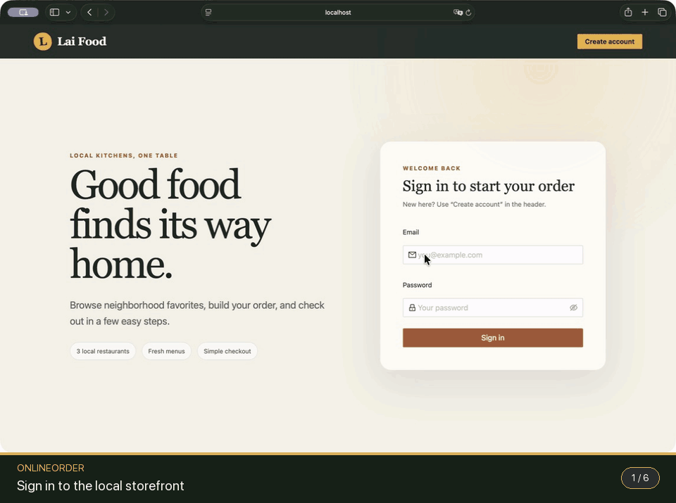
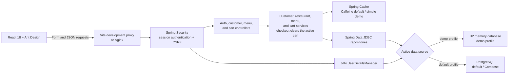

# OnlineOrder / Lai Food

OnlineOrder is a local food-ordering application with a Spring Boot 3 / Java 21 API, PostgreSQL persistence, session authentication, a React 18 client, idempotent sample-menu data, automated tests, and a Docker Compose development stack. No AWS account or other cloud credentials are required.

## Product tour



This is a live local run against the in-memory demo profile: sign in, browse Burger King's seeded menu, add two Chicken Fries, verify the quantity and `$9.78` total, and complete checkout. A [static poster frame](../docs/assets/demos/onlineorder-poster.png) is also available.

## What is implemented

- Account registration with normalized emails and BCrypt password hashes
- Session-based login/logout with session-fixation protection
- CSRF protection for every state-changing request; passwords are sent in a form body, never in the URL
- Public restaurant and menu browsing
- Per-customer carts, quantity aggregation, precise decimal totals, and demo checkout that clears the active cart
- Spring Cache for restaurants, menus, and carts—Caffeine in the default/PostgreSQL profile and the simple in-memory provider in the demo profile
- PostgreSQL constraints, indexes, referential integrity, and idempotent seed data
- Responsive React UI with registration, login, menu selection, cart drawer, and error/loading states
- Unit tests plus an authenticated API integration test using an in-memory PostgreSQL-compatible H2 database
- Docker images that run as non-root where applicable, health checks, and an Nginx reverse proxy

Checkout is intentionally a cart-completion boundary: `/cart/checkout` deletes the current cart items and resets its total. The project does not process payment or persist a completed-order ledger.

## Architecture



## Fastest credential-free start: in-memory demo

Prerequisites: Java 21, Node.js 20 or newer, and pnpm 11. No Docker, database server, password, or `.env` file is needed.

In terminal 1:

```bash
cd backend
./gradlew bootRun --args='--spring.profiles.active=demo'
```

In terminal 2:

```bash
cd frontend
pnpm install --frozen-lockfile
pnpm dev
```

Open <http://localhost:5173>, create an account, and sign in. The profile creates an H2 database in memory, loads the same schema and restaurant fixtures, and resets accounts and carts whenever the backend stops. Use the default profile or Compose below when persistence and PostgreSQL behavior are required.

## PostgreSQL start: Docker Compose

Prerequisite: Docker Desktop (or Docker Engine with Compose v2).

From this directory:

```bash
cp .env.example .env
```

Open `.env` and set `POSTGRES_PASSWORD` to a password used only for this local database. Compose rejects an empty value. Then run:

```bash
docker compose up --build
```

Open <http://localhost:3000>, create an account, and sign in. The API health endpoint is <http://localhost:8080/actuator/health>.
The development ports bind to `127.0.0.1` so the database, API, and HTTP-only local UI are not exposed to the surrounding network.

Stop the stack while preserving database data:

```bash
docker compose down
```

To also delete the local PostgreSQL volume and all registered accounts:

```bash
docker compose down --volumes
```

## Run services directly for development

Prerequisites:

- Java 21
- Node.js 20 or newer and pnpm 11 (`npm install --global pnpm@11.7.0`)
- Docker, for the local PostgreSQL container

First create `.env` as described above and start only PostgreSQL:

```bash
docker compose up -d db
```

In terminal 1:

```bash
cd backend
export DATABASE_HOST=localhost
export DATABASE_PORT=5432
export DATABASE_NAME=onlineorder
export DATABASE_USERNAME=onlineorder
export DATABASE_PASSWORD='the-password-you-put-in-.env'
./gradlew bootRun
```

The checked-in Gradle Wrapper downloads Gradle 8.14.3 into the user's Gradle cache and verifies the distribution checksum. `gradlew.bat` provides the equivalent workflow on Windows.

In terminal 2:

```bash
cd frontend
pnpm install --frozen-lockfile
pnpm dev
```

Open <http://localhost:5173>. Vite proxies API and authentication requests to port 8080, so browser sessions and CSRF cookies work in local development.

## Tests and production builds

Backend tests do not need PostgreSQL or Docker:

```bash
cd backend
./gradlew test
```

Frontend tests and build:

```bash
cd frontend
pnpm install --frozen-lockfile
pnpm test
pnpm build
```

Run both builds from the project root:

```bash
(cd backend && ./gradlew clean test bootJar)
(cd frontend && pnpm install --frozen-lockfile && pnpm test && pnpm build)
```

## API contract

| Method | Path | Authentication | Purpose |
| --- | --- | --- | --- |
| `GET` | `/auth/csrf` | Public | Issue a CSRF token for browser mutations |
| `GET` | `/auth/me` | Public | Return current session status |
| `POST` | `/signup` | Public + CSRF | Create a customer and empty cart |
| `POST` | `/login` | Public + CSRF | Start a session; form fields are `email` and `password` |
| `POST` | `/logout` | Required + CSRF | End the session |
| `GET` | `/restaurants/menu` | Public | List restaurants with nested menus |
| `GET` | `/restaurant/{id}/menu` | Public | List one restaurant's menu |
| `GET` | `/cart` | Required | Read the current customer's cart |
| `POST` | `/cart` | Required + CSRF | Add one item; JSON body is `{ "menu_id": 1 }` |
| `POST` | `/cart/checkout` | Required + CSRF | Clear the current cart |

The React client obtains the CSRF token automatically. For a manual API client, first call `GET /auth/csrf`, preserve both cookies, and send the returned token in the returned header name on each `POST`.

## Configuration

| Variable | Required | Default | Meaning |
| --- | --- | --- | --- |
| `DATABASE_PASSWORD` | Yes outside tests/demo | none | PostgreSQL password |
| `DATABASE_HOST` | No | `localhost` | PostgreSQL host |
| `DATABASE_PORT` | No | `5432` | PostgreSQL port |
| `DATABASE_NAME` | No | `onlineorder` | Database name |
| `DATABASE_USERNAME` | No | `onlineorder` | Database user |
| `DATABASE_POOL_SIZE` | No | `10` | Maximum JDBC connection-pool size |
| `INIT_DB` | No | `always` | Spring SQL initialization mode; scripts are idempotent |
| `SERVER_PORT` | No | `8080` | API port |
| `SESSION_COOKIE_SECURE` | No | `false` | Set `true` when serving over HTTPS |
| `SPRING_PROFILES_ACTIVE` | No | none | Set to `demo` for the disposable in-memory H2 workflow |

No user password is included in the seed files. Restaurants and menu items are seeded; users register through the application. Remote menu images are optional presentation assets—the application remains usable if they are unavailable.

## Project layout

```text
onlineorder/
├── backend/             Spring Boot / Gradle API
│   └── src/main/resources/application-demo.yml  in-memory runtime profile
├── frontend/            React / Vite client and Nginx image
├── docker-compose.yml   PostgreSQL + API + web stack
└── .env.example         safe configuration template
```
